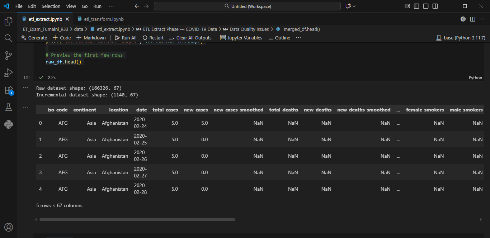
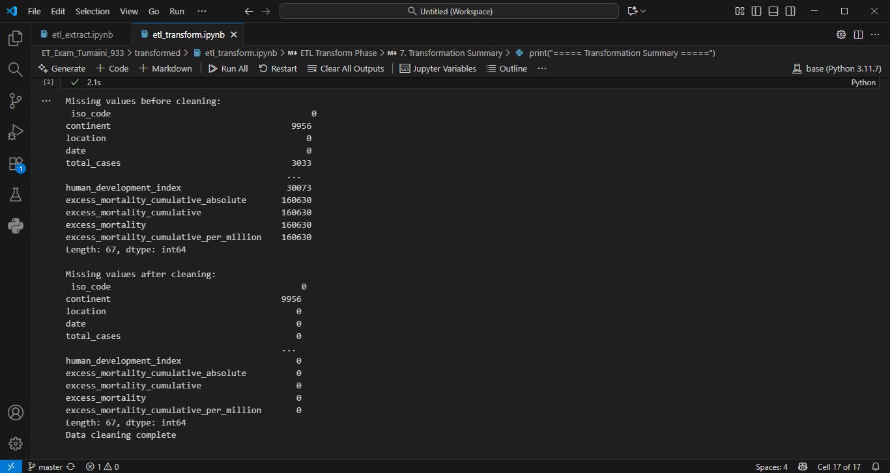

🧩 ETL Exam Project — COVID-19 Data

1. 📘 Project Overview

This project demonstrates the ETL (Extract, Transform, Load) process using a real-world dataset.
The goal is to extract, clean, and transform COVID-19 data from Kaggle to prepare it for further analysis.

The process follows the standard data engineering workflow:

Extract: Load and validate raw and incremental datasets.

Transform: Clean, standardize, and structure the validated data for analysis.

2. 🌐 Data Source

Dataset: Our World in Data — COVID-19 Dataset

Description:
The dataset contains global COVID-19 statistics such as confirmed cases, deaths, tests, hospitalizations, and vaccinations by date and country.

3. ⚙️ ET Phases
🔹 Extract Phase (etl_extract.ipynb)

Loaded raw_data.csv and incremental_data.csv using Pandas.

Displayed .head(), .info(), and .describe() to explore structure.

Identified data quality issues (missing values, duplicates, inconsistent data types).

Merged both datasets and validated by removing duplicates.

Saved a clean version as validated_data.csv in the /data/ folder.

🔹 Transform Phase (etl_transform.ipynb)

Cleaned missing values and standardized column types.

Performed data standardization (dates, numeric columns).

Applied enrichment by creating new metrics or derived columns (e.g., amount_millions).

Conducted structural transformation — kept key fields and renamed columns.

Categorized data where necessary and saved outputs to /transformed/.

Generated summary statistics for verification.

4. 🧰 Tools Used

Python 3.11

Pandas — data manipulation

Jupyter Notebook — documentation and execution

OS library — file path management

5. 🚀 Steps to Run the Project

Clone or Download this project folder.

Ensure the folder structure is as follows:

ET_Exam_Tumaini_933/
├── data/
│   ├── raw_data.csv
│   ├── incremental_data.csv
│   └── validated_data.csv
├── transformed/
│   ├── transformed_full.csv
│   ├── transformed_incremental.csv
├── etl_extract.ipynb
├── etl_transform.ipynb
├── README.md
└── .gitignore

Open etl_extract.ipynb and etl_transform.ipynb in Jupyter Notebook or VS Code.

Run all cells in order.

Check the /data/ and /transformed/ folders for saved outputs.

6. 🖼️ Sample Outputs / Screenshots

Below are sample outputs from the ETL process.

### Extract Phase Output

### Transform Phase Output

